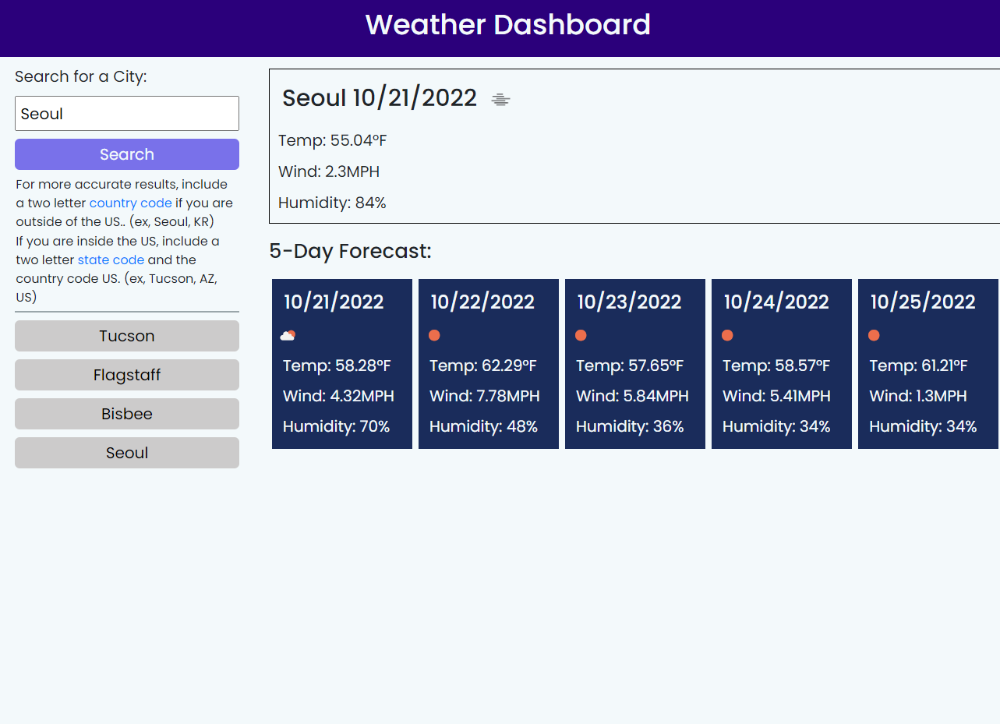

# 06 Weather Dashboard

## Description

This prroject is the sixth challenge from the U of A coding bootcamp. This weather dash takes a user input and searches through external data to return the current weather and five day forecast of a given city. Buttons that display previously searced cities and the elements that show the five day forecast are dynamically rendered with JavaScript. In this project, I utilized some Bootstrap, but implement som custom styling also. I chose to write vanilla JavaScript for this project because I wanted more practice and to get a firmer understanding of it. I used the [OpenWeather](https://openweathermap.org/) API to retrieve the external data for the weather.

Over the course of completing this project, I realized I'm getting a much better at recognizing which tasks will need condital statements and loops before I begin writing the program. Also, completing this project has given me a better sense of how to utilize APIs to retrieve data from external sources. Luckily, the OpenWeather API was fairly easy to read and use in my code. However, the fact that some of its data was locked behind a paywall was frustrating even if it's understandable.  

**Deployed Website:** [Weather Dashboard](https://ggorosave.github.io/Weather_Dash/)

## Credits
I used the following APIs to help complete this project:
- [OpenWeather](https://openweathermap.org/)
- [Day.js](https://day.js.org/en/)
- [Bootstrap v4.5](https://getbootstrap.com/docs/4.5/getting-started/introduction/)

## License
Copyright (c) 2022 Grant Gorosave.

Licensed under the [MIT](https://github.com/ggorosave/Weather_Dash/blob/main/LICENSE) license.